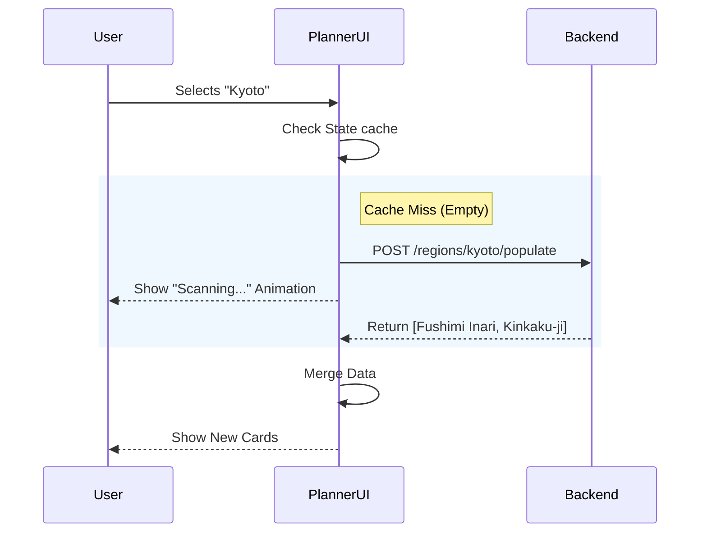

# Client Side Architecture (Technical Whitepaper)

> [!NOTE]
> This document is a **Technical Specification** for the Frontend of the **AltairLabs Travel Intelligence Platform**. It details the exact file structure, state management strategies, and component implementations used in production.

## 1. System Overview

The frontend is a **Single Page Application (SPA)** built with **React 19** and **Vite**. It is designed for high performance (`v7` bundler), strict type-safety (ESLint), and rapid component iteration (`Fast Refresh`).

*   **Repository Root**: `d:\Projects\AltairLabs`
*   **Source Root**: `src/`
*   **Entry Point**: `main.jsx` -> `App.jsx`

## 2. Detailed Project Structure

```text
src/
├── assets/                  # Static binaries (Images, SVGs)
├── components/              # Shared UI Building Blocks
│   ├── Destinations/        # The Destination Grid System
│   │   ├── DestinationCard.jsx  # Individual Card Component
│   │   ├── Destinations.jsx     # Grid Container & Filter Logic
│   │   └── Destinations.module.css # Scoped Styles
│   ├── Hero/                # Landing Page Hero
│   ├── Navbar/              # Navigation Bar
│   ├── TripPlanner/         # Trip Planner Specifics
│   │   ├── DateSelectionModal.jsx # Date Picker Logic
│   │   └── DestinationCard.jsx    # Selectable Card Variant
│   └── ...
├── data/                    # Static Data (Fallbacks)
├── pages/                   # Route Targets
│   ├── Home.jsx             # /
│   ├── TripPlannerPage.jsx  # /planner (The Core Engine)
│   ├── DestinationDetails.jsx # /destinations/:id
│   └── ...
├── services/                # API Integration Layer
│   └── TripAI.js            # Encapsulates all AI/Backend calls
├── styles/                  # Global Design System
│   └── index.css            # CSS Variables & Reset
└── App.jsx                  # Main Router
```

## 3. Core Routing & Navigation (`App.jsx`)

We use `react-router-dom` v7 with a standard `BrowserRouter`.

**Route Definition Table:**
| Route Pattern | Component Module | Prop Strategy |
| :--- | :--- | :--- |
| `/` | `pages/Home.jsx` | Static |
| `/destinations` | `components/Destinations/Destinations.jsx` | Fetches data on mount |
| `/destinations/:id` | `pages/DestinationDetails.jsx` | Uses `useParams().id` to fetch |
| `/planner` | `pages/TripPlannerPage.jsx` | Self-contained State Machine |
| `/blogs` | `components/Blogs/Blogs.jsx` | Static |

> [!IMPORTANT]
> **Scroll Restoration**: We implement a custom `ScrollToTop` component to ensure the user always starts at the top of the page when navigating between routes.

## 4. The Trip Planner Engine (`TripPlannerPage.jsx`)

This is the most complex component in the system. It implements a **4-Step Finite State Machine**.

### State Management Strategy
Instead of Redux, we use a giant local state object approach for simplicity and performance in this specific wizard context.

```javascript
// The "Brain" of the Planner
const [step, setStep] = useState(1);
const [selectedCountry, setSelectedCountry] = useState(null); // Step 1
const [selectedStates, setSelectedStates] = useState([]);     // Step 2
const [selectedDestinations, setSelectedDestinations] = useState([]); // Step 3
const [itinerary, setItinerary] = useState([]);               // Step 4
```

### The "Auto-Population" Algorithm (Step 3)
When a user selects a region (e.g., "Kyoto") that has no curated data, the frontend triggers the **Satellite Scan** protocol.

**Code Logic (`checkAndFetchData`):**
1.  **Check**: Is the current region empty in `destinations` state?
2.  **Trigger**: If yes, set `fetchingRegion(true)`.
3.  **API Call**: `POST /regions/{id}/populate`.
4.  **Response**: Receive a list of 3-5 new AI-generated destinations.
5.  **Merge**: `setDestinations(prev => [...prev, ...newItems])`.
6.  **UI**: Visual "Radar" animation plays during the wait.



## 5. Styling System & Design Tokens

We strictly use **Native CSS Variables** for theming to avoid the bundle bloat of CSS-in-JS libraries.

**`index.css` (The Design System):**
```css
:root {
  /* Brand Colors */
  --primary: #0f172a;       /* Slate 900 */
  --secondary: #3b82f6;     /* Blue 500 */
  --accent: #f59e0b;        /* Amber 500 */
  
  /* Text */
  --text-main: #1e293b;
  --text-light: #64748b;
  
  /* Spacing */
  --radius-sm: 8px;
  --radius-lg: 16px;
}
```

**Glassmorphism Strategy**:
We use a standardized class for the "Premium" feel seen in modals and floating headers:
```css
.glass-panel {
  background: rgba(255, 255, 255, 0.8);
  backdrop-filter: blur(12px);
  -webkit-backdrop-filter: blur(12px);
  border: 1px solid rgba(255, 255, 255, 0.3);
}
```
