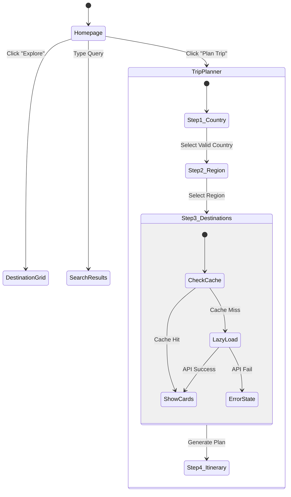

# User Journey Map (Interaction Specifications)

> [!NOTE]
> This document details the exact **Finite State Machine (FSM)** of the user interaction, including Happy Paths, Empty Paths, and Error States.

## 1. The Interaction Graph

The entire application flow can be modeled as a directed graph.

## 2. Detailed "Happy Path" (The 90% Case)

**User**: New Visitor.
**Goal**: Plan a trip to **Kyoto**.

| Step | Interaction | System Internal State | UI Response |
| :--- | :--- | :--- | :--- |
| **1** | Click "Plan Trip" | `step: 1` | Scroll to Top. Show Country Grid. |
| **2** | Select "Japan" | `selectedCountry: "jp"` | Button "Next Step" Enabled. |
| **3** | Click "Next" | `step: 2` | Fetch `regions` filtered by `country="jp"`. |
| **4** | Select "Kyoto" | `selectedStates: ["Kyoto"]` | Card Border turns Blue. Checkmark appears. |
| **5** | Click "Next" | `step: 3` | **CRITICAL**: Checks `destinations` DB for `location="Kyoto"`. |
| **6** | **(Cache Hit)** | `loading: false` | Show 12 cards immediately. |
| **7** | Select 3 Spots | `selectedDestinations: [101, 102, 103]` | "Generate AI Plan" Enabled. |
| **8** | Click "Generate" | `step: 4`, `loading: true` | Spinner "Consulting AI Agent...". |
| **9** | **(Success)** | `itinerary: [...]` | Show Day-by-Day View + Budget Alert. |

## 3. The "Empty Path" (Lazy Loading Edge Case)

**User**: Explorer.
**Goal**: Plan a trip to **"Aomori"** (Empty Region).

| Step | Interaction | System Internal State | UI Response |
| :--- | :--- | :--- | :--- |
| **1-4** | Same as above | ... | ... |
| **5** | Click "Next" | `step: 3` | **CRITICAL**: Checks DB. Count = 0. |
| **6** | **(Cache Miss)** | `fetchingRegion: true` | **UI TRANSITION**: Radar Animation overlay appears. |
| **7** | **Background** | `POST /regions/aomori/populate` | Text: "Scanning Satellite Data for Aomori..." |
| **8** | **(API Success)** | `destinations.push(...newItems)` | Animation fades out. New cards slide in. |
| **9** | **User sees** | New cards tagged "New" | User continues normally. |

## 4. Error States & Recovery

### A. The "Offline" Scenario
*   **Trigger**: User clicks "Generate Plan" but Backend is down.
*   **System Action**: `fetch()` throws `NetworkError`.
*   **UI Response**:
    > [!WARNING]
    > **Toast**: "Connection to AI Backend failed. Please ensure the Python server is running."
*   **Recovery**: User must restart server/check connection and click "Retry".

### B. The "No Search Results" Scenario
*   **Trigger**: User types "Mars" in Search Bar.
*   **System Action**: Nominatim returns `[]`.
*   **UI Response**:
    *   Show "Empty State" Illustration.
    *   Text: "We couldn't find any regions matching 'Mars'."
    *   Button: "Clear Search".
